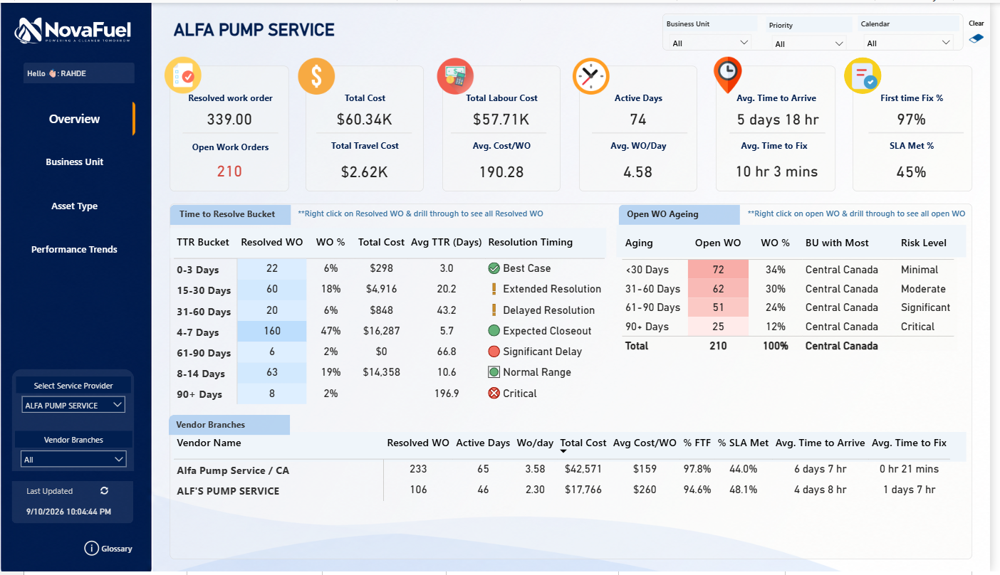
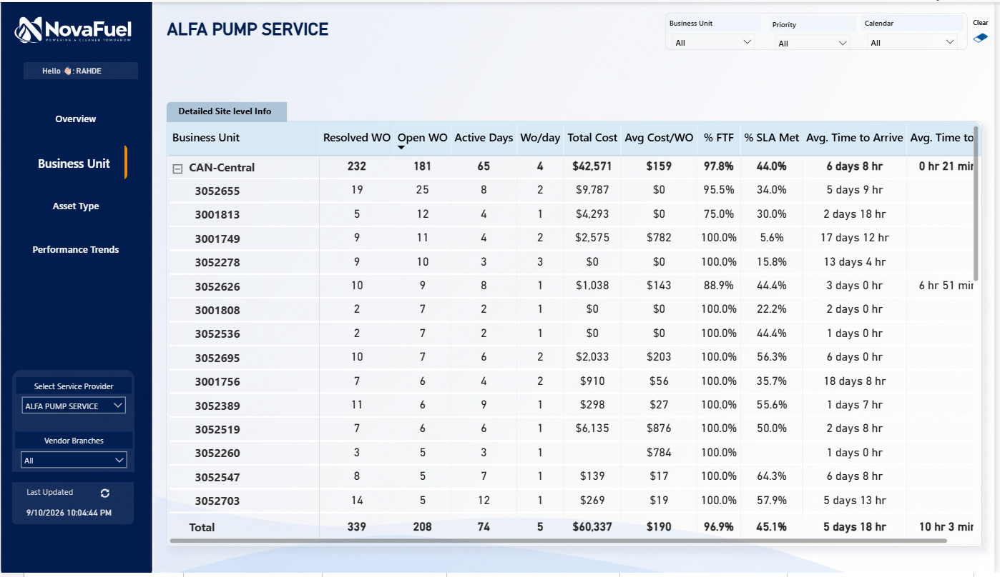
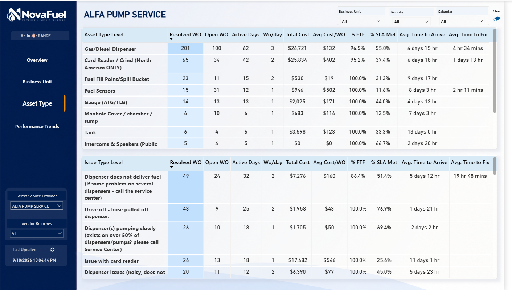
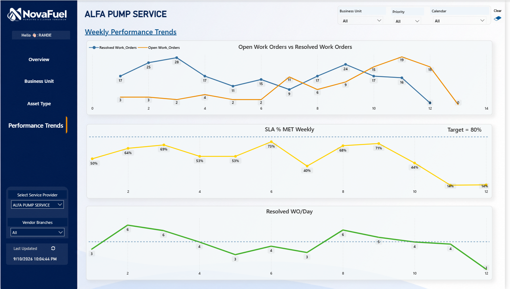
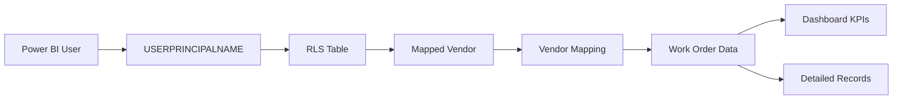
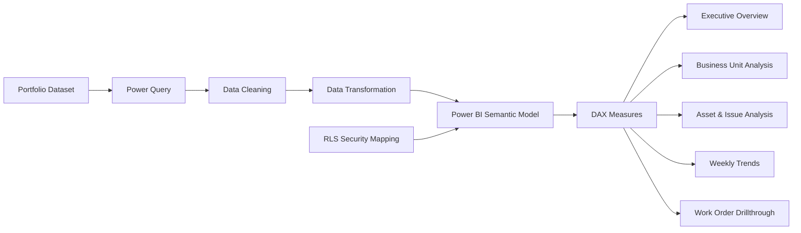

# 🛠️ Facilities Maintenance & Vendor Performance Analytics


> An end-to-end **Power BI Facilities Maintenance & Vendor Performance Analytics solution** designed to analyze work-order lifecycle, service-provider performance, SLA compliance, First-Time-Fix performance, maintenance cost, operational backlog, asset reliability, regional performance, weekly trends, and secure vendor-specific reporting using **Row-Level Security (RLS)**.

---

# 📊 Executive Dashboard



---

# 📌 Project Overview

Facilities maintenance operations generate large volumes of work orders across multiple:

- Service providers
- Vendor branches
- Business units
- Geographic locations
- Sites
- Asset types
- Issue categories
- Priorities
- Fiscal periods

Raw work-order data alone does not provide enough information for operational decision-making.

Facilities and vendor-management teams need answers to questions such as:

- How many work orders are currently open?
- How many work orders have been resolved?
- Which vendors are performing well?
- Which service providers are missing SLA expectations?
- What is the First-Time-Fix rate?
- Which locations have the largest maintenance backlog?
- Which asset categories generate the highest workload?
- Which issues create the highest maintenance cost?
- How quickly are vendors responding to service requests?
- How long does it take to complete repairs?
- Which open work orders are becoming operational risks?
- How is performance changing week over week?
- How much does each work order cost?
- Which vendor branches have weaker operational performance?
- Can multiple vendors use the same report securely without seeing each other's data?

This project brings these analytical requirements into a single Power BI reporting solution.

---

# 🎯 Business Objective

The objective of the project was to build a reporting application that combines:

```text
Executive Monitoring
        ↓
Operational Analysis
        ↓
Vendor Performance
        ↓
Regional / Site Analysis
        ↓
Asset & Issue Analysis
        ↓
Trend Monitoring
        ↓
Detailed Work-Order Investigation
        ↓
Secure Vendor-Specific Access
```

The result is a reusable Power BI solution that provides both high-level management reporting and detailed operational analysis.

---

# 💡 Solution Overview

The report consists of several analytical layers:

```text
Executive Overview
        │
        ▼
Business Unit / Site Analysis
        │
        ▼
Asset & Issue Analysis
        │
        ▼
Weekly Performance Trends
        │
        ▼
Resolved Work Order Drillthrough
        │
        ▼
Open Work Order Drillthrough
```

Security is implemented through **vendor-specific Row-Level Security**, allowing multiple vendors to consume the same Power BI report while maintaining strict data isolation.

---

# 🔐 Dynamic Row-Level Security

One of the core technical features of this solution is **Dynamic Row-Level Security (RLS)**.

The business requirement is:

> A vendor user must only be able to view the work orders, costs, KPIs, sites, assets, issues, and detailed records assigned to their vendor.

For example:

```text
Logged-In User
        │
        ▼
vendor.alfa@portfolio-demo.com
        │
        ▼
RLS User Mapping
        │
        ▼
ALFA PUMP SERVICE
        │
        ▼
Only ALFA PUMP SERVICE Data
```

A user mapped to ALFA PUMP SERVICE cannot access another vendor's information.

---

# 🛡️ RLS Security Flow

```text
Power BI User Login
        │
        ▼
USERPRINCIPALNAME()
        │
        ▼
RLS Security Table
        │
        ▼
User-to-Vendor Mapping
        │
        ▼
Mapped Vendor
        │
        ▼
Vendor / Work Order Filtering
        │
        ▼
Secure Dashboard
```

The security filter applies throughout the report.

This includes:

- KPI cards
- Tables
- Matrices
- Business-unit analysis
- Asset analysis
- Issue analysis
- Trend charts
- Maintenance costs
- Detailed open work orders
- Detailed resolved work orders
- Drillthrough pages

---

# 👤 Example Vendor Security Scenario

Assume the following user logs in:

```text
vendor1@portfolio-demo.com
```

The RLS mapping table associates that user with:

```text
ALFA PUMP SERVICE
```

The report therefore displays only:

```text
ALFA PUMP SERVICE
```

data.

The user cannot access:

```text
Vendor B
Vendor C
Vendor D
```

records.

---

# ✅ RLS Validation

| Test Scenario | Expected Result |
|---|---|
| ALFA vendor user | Only ALFA work orders visible |
| Vendor B user | Only Vendor B records visible |
| Vendor C user | Only Vendor C records visible |
| Unmapped vendor user | No authorized vendor data |
| Drillthrough under RLS | Only authorized detailed records |
| KPI calculation under RLS | Calculated only from authorized rows |

This enables a **single semantic model and report** to securely support multiple vendors.

---

# 💼 Why RLS Matters

Without RLS, separate reports may be required:

```text
Vendor A Report
Vendor B Report
Vendor C Report
Vendor D Report
```

This creates duplicated logic and additional maintenance.

With RLS:

```text
                     ONE REPORT
                         │
             ┌───────────┼───────────┐
             │           │           │
             ▼           ▼           ▼
          Vendor A    Vendor B    Vendor C
             │           │           │
             ▼           ▼           ▼
         A Data Only B Data Only C Data Only
```

### Benefits

- One Power BI report
- One semantic model
- Centralized DAX logic
- Consistent KPI definitions
- Secure vendor isolation
- Easier deployment
- Lower maintenance effort
- Better scalability

---

# 📈 Key Performance Indicators

| KPI | Description |
|---|---|
| **Resolved Work Orders** | Completed maintenance requests |
| **Open Work Orders** | Current maintenance backlog |
| **Total Cost** | Total maintenance expenditure |
| **Total Labour Cost** | Labour-related maintenance spend |
| **Total Travel Cost** | Provider travel-related cost |
| **Active Days** | Days containing maintenance activity |
| **Avg. WO / Day** | Average work-order throughput per active day |
| **Avg. Cost / WO** | Average cost per resolved work order |
| **Avg. Time to Arrive** | Average provider response duration |
| **Avg. Time to Fix** | Average repair duration |
| **First-Time-Fix %** | Work orders resolved without repeat intervention |
| **SLA Met %** | Work orders meeting defined SLA expectations |

---

# 📊 Dashboard Walkthrough

## 1️⃣ Executive Overview


The Executive Overview provides a consolidated view of facilities-maintenance operations.

### Main KPIs

- Resolved Work Orders
- Open Work Orders
- Total Cost
- Total Labour Cost
- Total Travel Cost
- Active Days
- Avg. Work Orders / Day
- Avg. Cost / Work Order
- Avg. Time to Arrive
- Avg. Time to Fix
- First-Time-Fix %
- SLA Met %

### Additional Analytics

The page also includes:

- Time-to-Resolve analysis
- Open Work Order Aging
- Operational Risk classification
- Vendor Branch comparison
- Maintenance cost analysis
- Vendor response-time analysis
- Vendor repair-time analysis

### Analytical Purpose

The page allows a decision maker to quickly answer:

> What is the current health of maintenance operations, and where should attention be focused?

When RLS is applied, all KPI values automatically reflect only the records authorized for the logged-in vendor.

---

# 2️⃣ Business Unit / Region / Site Analysis



This page provides deeper analysis across business units and individual sites.

The report supports hierarchical investigation:

```text
Business Unit
      │
      ▼
Site
```

### Metrics Available

- Resolved Work Orders
- Open Work Orders
- Active Days
- Work Orders per Day
- Total Cost
- Avg. Cost / WO
- First-Time-Fix %
- SLA Met %
- Avg. Time to Arrive
- Avg. Time to Fix

### Business Questions

This page helps identify:

- Regions generating the highest workload
- Sites with large maintenance backlogs
- Locations with unusually high costs
- Low-performing SLA areas
- Sites with slow vendor response
- Locations requiring operational intervention

Vendor users only see locations associated with their authorized work orders.

---

# 3️⃣ Asset & Issue Analysis



This page evaluates maintenance performance at both:

```text
Asset Type Level
       +
Issue Type Level
```

---

## Asset-Level Analysis

Asset categories can include examples such as:

- Fuel dispensers
- Card readers
- Fuel sensors
- Gauges
- Tanks
- Communication equipment
- Other facilities assets

### Metrics

- Resolved WO
- Open WO
- Active Days
- WO / Day
- Total Cost
- Avg. Cost / WO
- First-Time-Fix %
- SLA Met %
- Avg. Time to Arrive
- Avg. Time to Fix

### Questions Answered

- Which asset generates the most work orders?
- Which asset categories are most expensive to maintain?
- Which assets have poor SLA performance?
- Which assets require longer provider response?
- Which assets may have reliability issues?

---

## Issue-Level Analysis

Issue-level analysis helps identify:

- High-frequency maintenance issues
- High-cost problem categories
- Issues associated with low SLA performance
- Issues requiring longer repair cycles
- Issues with weaker First-Time-Fix performance

The analytical flow becomes:

```text
Which asset is experiencing problems?
                │
                ▼
What issue is occurring?
                │
                ▼
How is that issue impacting cost and service performance?
```

---

# 4️⃣ Weekly Performance Trends



The Weekly Performance Trends page analyzes operational movement over time.

---

## Open vs Resolved Work Orders

This analysis compares unresolved workload against completed work.

It helps answer:

> Is work being resolved fast enough to prevent backlog accumulation?

---

## Weekly SLA %

Weekly SLA performance is monitored against a target benchmark.

This can help identify:

- SLA deterioration
- Vendor performance changes
- Operational disruptions
- Periods requiring investigation
- Improvement following corrective action

---

## Resolved Work Orders / Day

This measures operational throughput.

It can reveal:

- Productivity changes
- High-performing periods
- Slowdowns
- Vendor capacity changes
- Workload fluctuations

---

# 5️⃣ Resolved Work Order Drillthrough


Power BI drillthrough allows users to move from summarized KPIs directly into detailed work-order records.

### Example Fields

- Opened Date
- Fiscal Year
- Fiscal Period
- Work Order ID
- Work Order State
- Site ID
- Asset Group
- Asset Type
- Business Unit
- Additional operational attributes

### User Journey

```text
Resolved Work Orders KPI
          │
          ▼
Right Click
          │
          ▼
Drillthrough
          │
          ▼
Detailed Resolved Work Orders
```

RLS remains active during drillthrough.

A vendor therefore cannot access another vendor's detailed records.

---

# 6️⃣ Open Work Order Drillthrough


The Open Work Order drillthrough page provides record-level visibility into current maintenance backlog.

Users can investigate records using fields such as:

- Opened Date
- Work Order State
- Site
- Asset Group
- Asset Type
- Business Unit
- Priority
- Fiscal Period

### Business Use

This supports investigation of:

- Aging work orders
- High-priority incidents
- Site-level backlog
- Problem assets
- Long-running service requests

RLS continues to restrict the underlying data.

---

# ⏳ Open Work Order Aging Analysis

A simple open-work-order count does not indicate backlog severity.

For this reason, open work orders are grouped into aging categories.

| Aging Bucket | Risk Level |
|---|---|
| **< 30 Days** | Minimal |
| **31–60 Days** | Moderate |
| **61–90 Days** | Significant |
| **90+ Days** | Critical |

Instead of only displaying:

```text
Open Work Orders = X
```

the dashboard provides:

```text
Open Work Orders
       +
Aging
       +
Risk Classification
       +
Business Unit
```

This makes the metric more actionable.

---

# ⏱️ Time-to-Resolve Analysis

Resolved work orders are grouped according to resolution duration.

| Resolution Time | Classification |
|---|---|
| **0–3 Days** | Best Case |
| **4–7 Days** | Expected Closeout |
| **8–14 Days** | Normal Range |
| **15–30 Days** | Extended Resolution |
| **31–60 Days** | Delayed Resolution |
| **61–90 Days** | Significant Delay |
| **90+ Days** | Critical |

### Business Questions

This analysis helps answer:

- Which work orders take longest to resolve?
- Which assets generate delayed repairs?
- Which sites experience longer resolution times?
- Which vendor branches require attention?
- Where are operational bottlenecks occurring?

---

# 🧩 Actual Power BI Data Model


The project uses a semantic model built around the **Work order** transactional table with supporting business, vendor, security, and calendar tables.

The major model components are:

```text
organization details
Vendor Mapp
Dim Vendor
RLS
Work order
Calendar
```

---

# 🏗️ Model Architecture

A simplified representation of the implemented model is:

```text
                     organization details
                              │
                              │ 1 : *
                              ▼
                         Work order
                              ▲
                              │
                              │
                         Vendor Mapp
                              │
                              ▼
                          Dim Vendor


                           Calendar
                              │
                              │ 1 : *
                              ▼
                         Work order


                       RLS Security Table
                              │
                              ▼
                      User / Vendor Access
```

The model separates:

- Transactional work-order data
- Organizational attributes
- Vendor mapping
- Standardized vendor dimensions
- Calendar logic
- Security mappings

---

# 📚 Data Model Tables

## 1. `Work order`

This is the primary transactional table in the model.

It contains work-order-level attributes such as:

- Asset Type
- Asset Issue Key
- Asset Type Display Value
- Business Unit
- Work Order Status
- Cost information
- Work-order timestamps
- Components
- Site-related fields
- Provider-related fields

The majority of operational KPIs are calculated from this table.

Examples include:

```text
Resolved Work Orders
Open Work Orders
Total Cost
Avg. Cost / WO
Avg. Time to Arrive
Avg. Time to Fix
FTF %
SLA %
```

---

## 2. `Calendar`

The Calendar table provides the time dimension used throughout the report.

It contains fields such as:

- Date
- Fiscal Week Number
- Fiscal Year
- Fiscal Period
- Month Number
- Period Key
- Period Label
- Week Number
- Year

The model contains multiple date relationships between `Calendar` and `Work order`.

This supports analysis using different work-order lifecycle dates.

For example:

```text
Opened Date
Resolved Date
Work Start Date
Work End Date
```

Some date relationships can remain inactive until explicitly required by a DAX measure.

This pattern enables different KPIs to use the appropriate business date without creating multiple calendar tables.

---

# 📅 Multiple Date Relationships

The work-order lifecycle contains multiple important timestamps.

Conceptually:

```text
                 Calendar
                    │
      ┌─────────────┼──────────────┐
      │             │              │
      ▼             ▼              ▼
 Opened Date   Resolved Date   Work Start Date
                                   │
                                   ▼
                              Work End Date
```

A measure can activate the appropriate relationship when required.

Representative DAX pattern:

```DAX
CALCULATE(
    [Work Order Measure],
    USERELATIONSHIP(
        Calendar[Date],
        'Work order'[Relevant Date]
    )
)
```

This allows:

- Opened-work-order analysis
- Resolved-work-order analysis
- Response-time reporting
- Repair-time reporting
- Fiscal-period analysis

from a common calendar dimension.

---

# 🏢 `organization details`

The `organization details` table provides organizational and geographic context.

It contains fields such as:

- Business Unit
- Business Unit Abbreviation
- Corporate Description
- Corporate ID
- Country
- Division
- Division ID
- GPS / address attributes

This dimension enables work-order performance to be analyzed by:

```text
Organization
     ↓
Business Unit
     ↓
Division
     ↓
Site / Location
```

This supports the Business Unit / Region analysis page.

---

# 🔄 `Vendor Mapp`

The `Vendor Mapp` table is used to standardize vendor and branch information.

It includes fields such as:

- Mapped Vendor
- Unique ID Vendor Branches
- Vendor Branches

This is particularly useful because operational systems may contain multiple branch-level provider names that logically belong to the same vendor organization.

For example:

```text
Vendor Branch 1
Vendor Branch 2
Vendor Branch 3
        │
        ▼
     Vendor Mapp
        │
        ▼
   Standard Vendor
```

This supports consistent vendor reporting across the dashboard.

---

# 🏷️ `Dim Vendor`

`Dim Vendor` provides the standardized vendor dimension.

The table contains the normalized:

```text
Mapped Vendor
```

value.

This enables the analytical model to report consistently at the parent-vendor level while still retaining detailed vendor-branch analysis.

---

# 🔐 `RLS`

The `RLS` table is the dedicated security mapping table.

It contains:

```text
Mapped Vendor
User email
```

Its purpose is to associate Power BI users with the vendors they are authorized to view.

Conceptually:

```text
User Email
    │
    ▼
Mapped Vendor
    │
    ▼
Vendor Data
```

The authenticated Power BI identity can be evaluated using:

```DAX
USERPRINCIPALNAME()
```

The user-to-vendor mapping is then used by the security role to restrict report data.

---

# 🏗️ Model Design Benefits

The implemented model provides several advantages.

### Separation of Responsibilities

Each table serves a clear purpose:

```text
Work order           → Transactional data
Calendar             → Time intelligence
organization details → Business hierarchy
Vendor Mapp          → Vendor normalization
Dim Vendor           → Standard vendor dimension
RLS                   → Data security
```

### Reusable Dimensions

Calendar, organization, and vendor attributes can be reused across multiple report pages.

### Consistent Filtering

Business Unit, Calendar, Vendor, and organizational filters propagate consistently through the model.

### Centralized Security

RLS is managed through a dedicated mapping structure rather than separate vendor reports.

### Scalability

The model can support additional vendors, users, business units, and work orders without redesigning individual dashboard pages.

---

# 🔐 Security Architecture



---

# 🏗️ Analytics Architecture



---

# 🧮 DAX & Analytical Logic

The report uses DAX to calculate dynamic KPIs according to:

- Current filter context
- Vendor selection
- Business-unit selection
- Fiscal period
- Priority
- Calendar
- RLS security context

Representative patterns are shown below.

---

## Average Cost per Work Order

```DAX
Avg Cost / WO =
DIVIDE(
    [Total Cost],
    [Resolved Work Orders],
    0
)
```

---

## First-Time-Fix %

```DAX
First Time Fix % =
DIVIDE(
    [First Time Fix Work Orders],
    [Resolved Work Orders],
    0
)
```

---

## SLA Met %

```DAX
SLA Met % =
DIVIDE(
    [Work Orders Meeting SLA],
    [Eligible Work Orders],
    0
)
```

---

## Work Orders per Active Day

```DAX
Avg WO / Day =
DIVIDE(
    [Resolved Work Orders],
    [Active Days],
    0
)
```

---

# 🔐 Dynamic RLS Pattern

The logged-in Power BI identity can be evaluated through:

```DAX
USERPRINCIPALNAME()
```

Representative security logic:

```DAX
'RLS'[User email] =
USERPRINCIPALNAME()
```

The resulting user mapping determines the vendor records available to the report user.

---

# 📅 Date Relationship Pattern

Because work orders contain multiple important dates, DAX can activate the required date relationship when calculating a KPI.

Representative pattern:

```DAX
Resolved Work Orders =
CALCULATE(
    [Base Work Order Count],
    USERELATIONSHIP(
        Calendar[Date],
        'Work order'[Resolved Date]
    )
)
```

This allows the same Calendar dimension to support multiple operational timelines.

---

# 🔄 Power Query Transformation

Power Query is used to prepare data before it enters the Power BI semantic model.

Typical transformations include:

- Data-type validation
- Null handling
- Date conversion
- Vendor normalization
- Vendor branch mapping
- Business-unit mapping
- Asset categorization
- Status standardization
- Column renaming
- Data cleanup
- Removal of unnecessary fields
- Creation of analytical attributes
- Security mapping preparation
- Data-quality validation

---

# 🎛️ Interactive Report Features

The solution is designed as an interactive analytical application rather than a static dashboard.

---

## Global Filters

Users can filter the report by:

```text
Business Unit
Priority
Calendar
Service Provider
Vendor Branch
```

---

# 🧭 Custom Navigation

The report contains dedicated navigation for:

```text
Overview
Business Unit
Asset Type
Performance Trends
```

This creates a consistent dashboard experience.

---

# 🔎 Drillthrough

Users can move directly from summarized metrics into detailed work-order records.

Example:

```text
Resolved Work Orders
        │
        ▼
Right Click
        │
        ▼
Drillthrough
        │
        ▼
Resolved Work Order Details
```

and:

```text
Open Work Orders
        │
        ▼
Right Click
        │
        ▼
Drillthrough
        │
        ▼
Open Work Order Details
```

RLS remains active throughout the drillthrough experience.

---

# 🎨 Conditional Formatting

Conditional formatting is used to highlight:

- High backlog
- Aging work orders
- SLA underperformance
- Resolution delays
- Cost differences
- Operational risk
- Performance exceptions

---

# 📁 Repository Structure

```text
Vendor-Performance-Analytics/
│
├── README.md
│
├── 01_Overview.png
├── 02_Region_level.png
├── 03_Asset_level.png
├── 04_Weekly_Trends.png
├── 05_drill_Resolved_Workorders.png
├── 06_drill_Open_Workorders.png
├── 07_Data_Model.png
├── Data.xlsx
└── Vendor Performance project.pbix
```

---

# 📥 Project Files

## Power BI Report

[Download the Power BI Report](./Vendor%20Performance%20project.pbix)

The `.pbix` file contains:

- Power BI report pages
- Semantic model
- Table relationships
- DAX measures
- Calendar logic
- Vendor mapping
- RLS configuration
- Navigation
- Drillthrough
- Visual interactions

---

## Dataset

[Download the Portfolio Dataset](./Data.xlsx)

The dataset included in this repository is intended for portfolio and demonstration purposes.

---

# 🚀 How to Explore the Project

## 1️⃣ Review the Dashboard

Start with the Executive Overview shown at the top of the README.

---

## 2️⃣ Download the Power BI File

Download:

```text
Vendor Performance project.pbix
```

and open it using:

```text
Power BI Desktop
```

---

## 3️⃣ Explore the Report Pages

Navigate through:

```text
Overview
Business Unit
Asset Type
Performance Trends
```

---

## 4️⃣ Use Interactive Filters

Experiment with:

```text
Business Unit
Priority
Calendar
Service Provider
Vendor Branch
```

---

## 5️⃣ Test Drillthrough

Select an applicable visual or record.

```text
Right Click
    ↓
Drillthrough
    ↓
Detailed Work Orders
```

---

## 6️⃣ Review the Data Model

Open:

```text
Model View
```

to inspect:

```text
organization details
Vendor Mapp
Dim Vendor
RLS
Work order
Calendar
```

---

## 7️⃣ Test Row-Level Security

In Power BI Desktop:

```text
Modeling
    ↓
View As
```

Select the configured vendor security role.

Simulate a mapped vendor identity.

The report should display only the work orders authorized for that vendor.

---

# 🧠 Technical Skills Demonstrated

## Power BI Development

- End-to-end Power BI development
- Executive dashboard design
- KPI development
- Report navigation
- Drillthrough
- Matrix analysis
- Conditional formatting
- Visual interactions
- Multi-page report design
- Operational reporting

---

## DAX

- CALCULATE
- DIVIDE
- Filter Context
- USERELATIONSHIP
- USERPRINCIPALNAME
- Conditional logic
- KPI measures
- Date-based calculations
- Dynamic filtering
- Time-based analysis

---

## Row-Level Security

- Dynamic RLS
- User identity detection
- User-to-vendor mapping
- Vendor-level data isolation
- Security filter propagation
- RLS testing
- Secure drillthrough
- Multi-vendor reporting architecture

---

## Power Query

- Data cleaning
- Data transformation
- Vendor mapping
- Data standardization
- Data-type conversion
- Data-quality preparation
- Business-rule transformations

---

## Data Modeling

- Fact and dimension modeling
- Semantic model development
- One-to-many relationships
- Multiple date relationships
- Active / inactive relationships
- Calendar dimension
- Vendor dimensions
- Organization dimensions
- Security mapping
- Filter propagation

---

## Business Analytics

- Facilities Management Analytics
- Vendor Performance Analytics
- Maintenance Analytics
- SLA Analysis
- First-Time-Fix Analysis
- Work-Order Analytics
- Cost Analytics
- Asset Analytics
- Issue Analytics
- Operational Risk
- Trend Analysis

---

# 💼 Business Value

## Vendor Performance Management

Service providers can be evaluated using:

- SLA %
- First-Time-Fix %
- Work-order volume
- Open backlog
- Response time
- Repair time
- Cost
- Cost per Work Order
- Resolution duration

---

## Secure Vendor Self-Service

Multiple service providers can use the same report while RLS automatically restricts access.

```text
One Report
+
One Semantic Model
+
Multiple Vendors
+
Secure Data Isolation
```

---

## Backlog Management

Aging analysis makes it easier to identify old and potentially critical work orders.

---

## Cost Optimization

The report can identify:

- High-cost vendors
- High-cost assets
- High-cost sites
- Cost-intensive maintenance issues
- High average cost per work order

---

## Asset Reliability

Asset and issue-level analysis highlights equipment categories creating disproportionate maintenance demand.

---

## SLA Management

Performance can be investigated by:

```text
Vendor
Business Unit
Site
Asset
Issue
Calendar Period
```

---

## Executive Visibility

Management receives a consolidated view of maintenance performance while retaining the ability to investigate detailed work orders when required.

---

# 🎨 Dashboard Design Principles

## 1. Executive First

Important operational KPIs are visible immediately.

---

## 2. Progressive Analysis

Users can move from:

```text
Overview
   ↓
Business Unit
   ↓
Site
   ↓
Asset
   ↓
Issue
   ↓
Work Order
```

---

## 3. Action-Oriented Analytics

Metrics are supplemented by business context such as:

```text
Aging
Risk
SLA
Cost
Resolution Time
Detailed Records
```

---

## 4. Consistent Navigation

Navigation and filtering remain consistent across report pages.

---

## 5. Detail on Demand

Users can begin with executive KPIs and investigate underlying work orders through drillthrough.

---

## 6. Security by Design

Vendor isolation is implemented through RLS at the semantic-model level rather than manually hiding visual elements.

---

# 🔮 Future Enhancements

Potential future enhancements include:

- Predictive maintenance
- Vendor performance scorecards
- Automated vendor ranking
- Maintenance cost forecasting
- Dynamic SLA targets
- Geographic site analysis
- Root-cause analysis
- Repeat-work-order detection
- Asset reliability scores
- Anomaly detection
- What-If analysis
- Decomposition Tree
- Mobile-optimized reporting
- Automated refresh
- Power BI Embedded
- RLS access audit reporting
- Vendor-access administration
- Automated user-to-vendor onboarding

---

# 🔒 Data Privacy & Portfolio Disclaimer

This repository is intended exclusively for **portfolio and demonstration purposes**.

The portfolio version uses synthetic, transformed, and/or anonymized information.

The repository does **not intentionally contain**:

- Confidential organizational information
- Corporate passwords
- Authentication credentials
- Security tokens
- Active SharePoint connections
- Active Databricks connections
- Internal server addresses
- Proprietary database paths
- Private corporate email addresses
- Internal URLs
- Confidential connection strings

The **NovaFuel** identity displayed in the report is fictional and is used solely for portfolio presentation.

Vendor names, users, IDs, costs, and operational information included in the public portfolio should be synthetic or anonymized.

---

# 📌 Project Information

| Attribute | Details |
|---|---|
| **Project** | Facilities Maintenance & Vendor Performance Analytics |
| **Project Type** | Power BI Portfolio Project |
| **Domain** | Facilities / Maintenance Analytics |
| **Primary Tool** | Power BI |
| **Calculation Language** | DAX |
| **Transformation Tool** | Power Query |
| **Core Fact Table** | Work order |
| **Calendar Dimension** | Calendar |
| **Organization Dimension** | organization details |
| **Vendor Mapping** | Vendor Mapp |
| **Vendor Dimension** | Dim Vendor |
| **Security Table** | RLS |
| **Security Model** | Dynamic Vendor-Level RLS |
| **Analytics Type** | Operational + Vendor Analytics |
| **Data Source** | Portfolio / Anonymized Dataset |
| **Reporting Style** | Executive + Analytical + Detail |

---

# 👨‍💻 Author

## Rahul Dewangan

**Power BI | SQL | Data Analytics | Business Intelligence**

I focus on designing analytical solutions that transform operational data into actionable business insights using:

- Power BI
- DAX
- SQL
- Power Query
- Data Modeling
- Row-Level Security
- Operational Analytics
- Vendor Analytics
- Business Intelligence

---

# 🔗 Connect With Me

## GitHub

[github.com/RahulDew234](https://github.com/RahulDew234)

## LinkedIn

[linkedin.com/in/rahul-dewangan-545235112](https://www.linkedin.com/in/rahul-dewangan-545235112)

---

# ⭐ Support

If you found this project interesting:

⭐ Star the repository  
🍴 Fork the project  
💬 Share feedback  
🔗 Connect with me on LinkedIn  

---

## Thank you for viewing the project!
